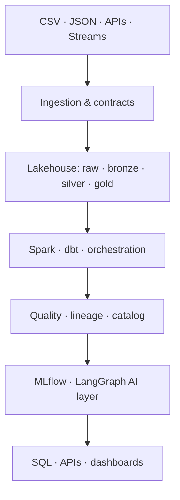

# RedLake AI

**A production-oriented Intelligent Data & AI Platform**

RedLake AI turns heterogeneous data into governed, traceable, AI-ready assets. It is a portfolio project designed to demonstrate the end-to-end engineering path that data-platform, data-engineering, and AI-engineering teams need: data capture, contracts, lakehouse storage, transformation, quality, lineage, analytics, and safe AI-assisted discovery.

> Status: **v0.1.0 — Catalog & Batch Ingestion Foundation**

## Product vision

Most portfolios show either an isolated ETL script or an isolated LLM app. RedLake AI is deliberately the bridge between them: a control plane and data plane that make data **reliable before it becomes useful to an analyst, model, or agent**.

Its guiding principles are:

- Preserve source bytes immutably, including rejected input in a quarantine zone.
- Treat schemas, quality results, provenance, and idempotency as first-class product features.
- Use open, portable interfaces: Python, SQL, S3-compatible storage, PostgreSQL, and Apache Iceberg.
- Build only verified capabilities into each release; planned integrations are documented as planned.
- Make every important result inspectable through APIs, metrics, tests, and release evidence.

## Target architecture



| Plane | Responsibility | v0.1.0 implementation |
| --- | --- | --- |
| Control plane | Dataset catalog, contracts, ingestion metadata, auditability | FastAPI + PostgreSQL-compatible SQLAlchemy catalog |
| Ingestion plane | Receive source data safely and idempotently | CSV/JSON uploads, SHA-256 checksum, bounded upload size |
| Storage plane | Preserve original bytes and separate unacceptable input | Local filesystem for development/tests; S3-compatible MinIO in Compose |
| Governance plane | Decide whether data may move forward | Schema profile + contract checks + auditable quality report |
| Observability plane | Make runtime behavior visible | JSON logs, request IDs, Prometheus `/metrics`, liveness/readiness |
| Future data plane | Transform, query, train and assist | Kafka, Spark, Iceberg, dbt, Airflow, MLflow, LangGraph |

## What v0.1.0 delivers

- Dataset catalog with versioned data contracts.
- CSV and JSON batch ingestion through a documented FastAPI API.
- Schema profiling, required-field/type checks, and a quality report stored with each run.
- Immutable raw-zone capture for accepted input and quarantine capture for rejected input.
- SHA-256 content fingerprints and `Idempotency-Key` replay protection.
- PostgreSQL/MinIO Docker Compose environment plus a local SQLite/filesystem development mode.
- Database migration, unit/API tests, structured logs, request IDs, Prometheus metrics, health probes, CI, and release documentation.

It intentionally does **not** claim Kafka, Spark, Iceberg, dbt, Airflow, MLflow, Kubernetes, or LangGraph implementation yet. Their placement is explicit in the roadmap below.

## Quick start

### Local development

```bash
python -m venv .venv
source .venv/bin/activate  # Windows PowerShell: .venv\Scripts\Activate.ps1
python -m pip install -e ".[dev]"
alembic upgrade head
uvicorn app.main:app --reload
```

Open <http://127.0.0.1:8000/docs>. Local mode creates SQLite metadata and raw objects under `./data/`.

### Full local platform

```bash
docker compose up --build
```

The API is at <http://localhost:8000>, MinIO Console at <http://localhost:9001>, and Prometheus at <http://localhost:9090>.

## Example workflow

Create a dataset and contract:

```bash
curl -X POST http://localhost:8000/api/v1/datasets \
  -H 'Content-Type: application/json' \
  -d '{"name":"customer-events","description":"Sample customer events"}'

curl -X POST http://localhost:8000/api/v1/datasets/customer-events/contracts \
  -H 'Content-Type: application/json' \
  -d '{
    "version":"0.1.0",
    "allow_extra_fields":false,
    "fields":[
      {"name":"event_id","data_type":"integer","required":true},
      {"name":"event_type","data_type":"string","required":true}
    ]
  }'
```

Ingest a CSV file:

```bash
curl -X POST http://localhost:8000/api/v1/datasets/customer-events/ingestions \
  -H 'Idempotency-Key: events-2026-10-03-001' \
  -F 'file=@events.csv;type=text/csv'
```

An accepted file is written under `raw/`; contract or parsing failures are written under `quarantine/`. In either case the ingestion record persists its checksum, profile, quality evidence, source URI, timestamps, and outcome.

## Roadmap

See [docs/ROADMAP.md](docs/ROADMAP.md) for the release-by-release plan through v1.0.0, and [docs/ARCHITECTURE.md](docs/ARCHITECTURE.md) for contracts, data zones, boundaries, and delivery decisions.

## Quality gates

```bash
make lint
make test
docker compose up --build
```

The CI workflow runs linting, tests with coverage, and a Docker build. Before a tagged release, use `python scripts/package_release.py` to create a clean source archive and checksum.

## Project structure

```text
app/                 FastAPI control plane, domain services, storage adapters
alembic/             Versioned metadata schema migrations
docs/                Architecture, contracts, decisions, roadmap, release evidence
monitoring/          Prometheus configuration
tests/               API and domain regression tests
.github/workflows/   CI validation
```

## Scope and safety

v0.1.0 is a single-tenant local/development foundation. Authentication, authorization, secret management, PII policy enforcement, streaming backpressure, and distributed compute are planned hardening work—not production claims. See [docs/ARCHITECTURE.md](docs/ARCHITECTURE.md#known-v01-limitations) for the exact boundary.

## License

Apache-2.0. See [LICENSE](LICENSE).
