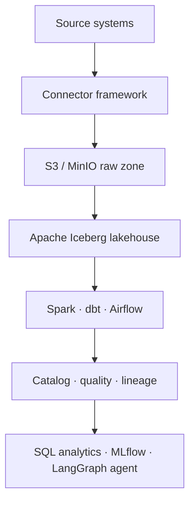
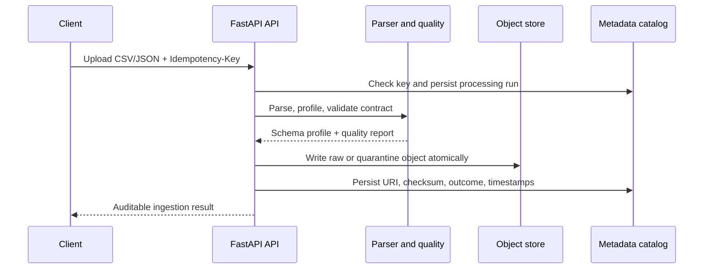

# RedLake AI Architecture

## Vision

RedLake AI is an intelligent data platform that makes source data trustworthy, discoverable, and useful for analytics and AI. It separates the **control plane** (metadata and governance decisions) from the **data plane** (source bytes, lakehouse tables, streams, and compute) so operational metadata is never hidden inside a notebook or a transient job log.

## End-state architecture

### Control plane

The control plane owns the durable answers to these questions:

- What is this dataset and which contract is currently active?
- Which bytes arrived, from where, and with which checksum?
- Did a run pass quality gates, get quarantined, or fail operationally?
- Which raw object and later table/lineage records are associated with that run?

v0.1.0 implements this with FastAPI, SQLAlchemy, an Alembic-managed catalog schema, and REST/OpenAPI endpoints.

### Data plane

The data plane preserves bytes and eventually computes on them.

| Zone | Purpose | v0.1.0 state |
| --- | --- | --- |
| Landing | Receive a source safely | Request body is bounded before processing |
| Raw | Immutable, source-preserving evidence | Implemented (`raw/…`) |
| Quarantine | Preserve invalid input without promoting it | Implemented (`quarantine/…`) |
| Bronze | Normalized append-only records | Planned with Spark/Iceberg |
| Silver | Validated, conformed data | Planned with Spark/dbt |
| Gold | Analytics-ready products | Planned with SQL/semantic metrics |

## v0.1.0 ingestion sequence

### Outcome semantics

| Status | Meaning | Raw bytes retained? | Client action |
| --- | --- | --- | --- |
| `succeeded` | Parsed and passed all error-level checks | Yes, in `raw/` | Continue downstream in a later release |
| `rejected` | Source or contract quality failed | Yes, in `quarantine/` | Repair source/contract and submit a new key |
| `failed` | Platform could not persist the source | No durable URI guaranteed | Retry with the same source after the platform recovers |

An identical payload with the same `Idempotency-Key` returns the already-completed run. Reusing a key with different bytes returns `409 Conflict`.

## Data contracts and quality

A contract has a semver-like version, a list of named fields, expected types, required flags, and an `allow_extra_fields` policy. On every accepted parse, RedLake records:

- row count and observed field profile;
- nullability and observed type set for each field;
- each quality check, its severity, status, and details;
- the exact active contract indirectly via the dataset catalog at run time.

The source bytes are not transformed in v0.1.0. Type coercion exists only for inspection of CSV scalar values; preserved raw objects remain unchanged.

## Storage adapters

- **Filesystem adapter:** local development and tests; atomic replacement prevents partial files.
- **S3 adapter:** AWS S3-compatible client; Docker Compose uses MinIO to make the same API runnable locally.

The application handles object keys internally and rejects path traversal attempts in the filesystem adapter.

## Observability and operability

- JSON logs include a request ID, timestamp, logger, level, and message.
- `X-Request-ID` is propagated or generated on every response.
- `/api/v1/health/live` answers process liveness.
- `/api/v1/health/ready` checks the database and object store.
- `/metrics` exposes Prometheus HTTP and ingestion counters/latency.
- Alembic owns the catalog schema in Compose and normal local development; automatic schema creation is an explicit test-only convenience.

## Known v0.1.0 limitations

- Single-tenant and unauthenticated by design; no RBAC or tenant isolation yet.
- File ingestion is limited to 10 MiB by default and supports `.csv` and `.json` only.
- No API connector, Kafka consumer, schema registry, Spark job, Iceberg table, dbt project, scheduler, lineage emitter, SQL engine, ML workflow, or AI agent is implemented yet.
- Object-store write failures are recorded as `failed`; a durable outbox/retry worker arrives in the reliability milestone.
- Readiness uses direct dependency checks; it is not a full capacity or SLO signal.

These limits are intentionally documented so the project remains interview-defensible.
