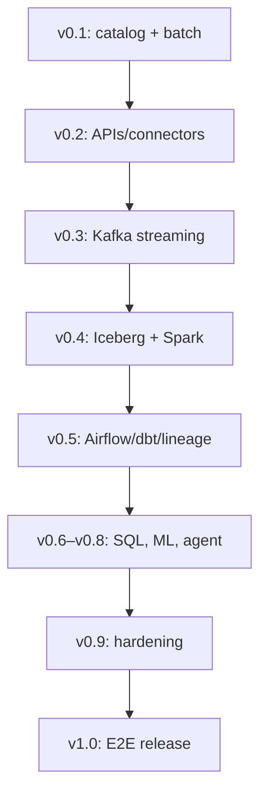

# RedLake AI Roadmap

This is a delivery roadmap, not a list of logos. A milestone is released only after its interface, automated tests, operational evidence, documentation, and limitations are present. Dates are intentionally omitted: quality evidence determines readiness.

| Release | Product outcome | Core implementation target | Evidence required to release |
| --- | --- | --- | --- |
| **v0.1.0** | Trusted batch-ingestion foundation | FastAPI catalog; CSV/JSON ingestion; PostgreSQL metadata; filesystem/MinIO raw storage; data contracts; profile/quality report; idempotency; Docker/CI/metrics | API + domain tests; migration; Compose smoke run; release notes |
| **v0.2.0** | Reusable connector framework | Source abstraction; REST API connector with pagination/retries/rate limits; scheduled pull trigger; secrets interface; connector run metadata | Fake-server integration tests; retry/idempotency tests; connector guide |
| **v0.3.0** | Governed streaming ingestion | Kafka + schema registry-compatible contract adapter; producer simulator; consumer offsets, dedupe, dead-letter/quarantine semantics | Testcontainers/Compose stream tests; replay and failure scenarios; throughput baseline |
| **v0.4.0** | Open lakehouse transformations | Apache Iceberg on S3/MinIO; Spark Bronze/Silver jobs; partitioning and schema evolution; data-product manifest | End-to-end raw-to-table test; table time-travel/demo; reproducible benchmark |
| **v0.5.0** | Orchestration, quality, and lineage | Airflow DAGs; dbt transformations/tests; OpenLineage-compatible event model; backfill/retry policy | DAG test + local execution; lineage graph evidence; quality-gate failure demo |
| **v0.6.0** | Analytics serving layer | SQL query service over curated tables; saved analytic views; API query audit; dataset freshness/status endpoint | Query regression suite; access-control design; explain-plan/performance evidence |
| **v0.7.0** | Reproducible ML workflows | Feature/training pipeline; MLflow tracking/model registry; data/version linkage; batch evaluation | Reproducibility test; model/data lineage evidence; baseline evaluation report |
| **v0.8.0** | Safe data intelligence agent | LangGraph analyst agent; read-only governed tools; semantic dataset discovery; SQL guardrails; run audit trail | Tool-policy tests; adversarial query tests; traced agent demonstration |
| **v0.9.0** | Production-readiness hardening | OpenTelemetry traces; Prometheus/Grafana dashboards; RBAC/API keys; secret handling; Kubernetes/Helm; backup/recovery drills | Load, recovery, and security evidence; deployment validation; SLO/runbook docs |
| **v1.0.0** | End-to-end platform release | A complete ingestion-to-insight reference data product using batch, streaming, lakehouse, analytics, ML, and agent capabilities | Clean install; full E2E suite; architecture review; benchmark + release manifest + demo |

## v0.1.0 acceptance criteria

The foundation is considered done only when all of the following are true:

1. A user can create a dataset and active contract via OpenAPI.
2. CSV and JSON inputs are profiled and quality-checked deterministically.
3. Passing inputs are immutable raw objects; rejected inputs survive in quarantine.
4. Every run exposes source details, SHA-256, profile, quality evidence, object URI, and timestamps.
5. Repeated keys do not duplicate storage; changed content with an old key is rejected.
6. Local SQLite/filesystem and Compose PostgreSQL/MinIO paths are both documented.
7. Lint, automated tests, and Docker build pass in CI.

## Architectural sequence

## Non-negotiable engineering rules

- Do not add a service merely to list it in the tech stack; each service must have a measurable use case and test.
- Preserve backwards-compatible contracts or publish migration instructions.
- Keep raw data immutable and record run-level provenance before transformation.
- Add failure modes and recovery behavior to the test plan with every new integration.
- Update architecture, README, and release evidence in the same pull request as a material feature.

